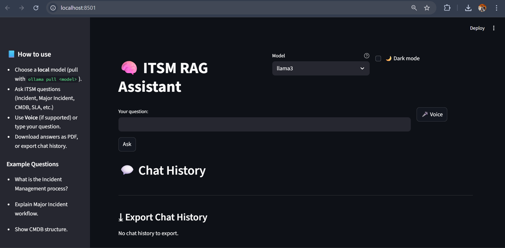
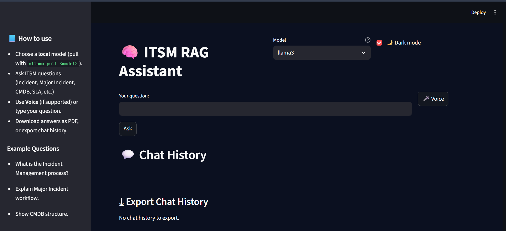
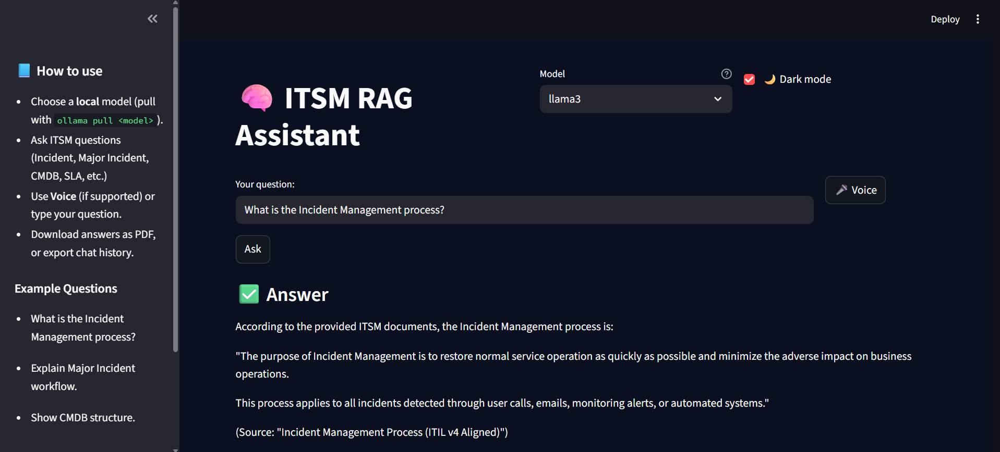

📘 ITSM RAG Assistant – AI-Powered ITIL Knowledge Assistant

A Retrieval-Augmented Generation (RAG) application designed for IT Service Management (ITSM) teams.
This assistant uses local LLMs (Llama 3, Phi-3 via Ollama) + LangChain 0.3+ + ChromaDB to answer ITIL/SOP-based questions such as:

Incident Management
Major Incident workflow
Problem Management & RCA
Change Management (Normal, Standard, Emergency)
CMDB & CI Relationships
SLA Matrix / Priority Matrix
On-call Procedures
ITIL v3/v4 Practices

Powered by your own SOP documents, ensuring 0% cloud dependency, 100% privacy, and highly accurate responses.

🚀 Features
Feature	Description
🔍 RAG Search	Retrieves most relevant SOP sections using ChromaDB
🧠 Local LLM	Uses Llama3 / Phi-3 via Ollama (no API cost, fully offline)
📄 Source Tracing	Shows exactly which documents were used
💬 Chat Bubble UI	ChatGPT-style modern chat interface
📁 Chat History	Stores all questions & responses
🗑️ Clear Chat	Reset conversation at any time
🌙 Dark Mode Toggle	Light / dark theme switch
🗣️ Voice Input	Ask questions by speaking
📄 Export Answer as PDF	Download generated responses
📦 Export Chat as TXT / JSON	Save your entire conversation
🔀 Multi-Model Selector	Switch between Llama3, Phi-3, Mistral (Ollama)
🎯 ITSM Focused	Trained on SOPs for Incident, Change, Problem, CMDB, SLA etc.
🧠 How It Works (Architecture)
flowchart TD
    A[User Query] --> B[Retriever (ChromaDB)]
    B --> C[Relevant SOP Chunks]
    C --> D[Prompt Template]
    D --> E[Local LLM via Ollama]
    E --> F[Final Answer]
    F --> G[Streamlit UI]

    B <---> H[HuggingFace Embeddings]

📂 Project Structure
ITSM_RAG_ASSISTANCE/
│── app.py                     # Streamlit UI with chat, PDF, voice, dark mode
│── ingest.py                  # Loads SOP files → creates vector DB
│── data/                      # Your ITIL & ITSM SOP documents
│   └── sops/                  # All .txt knowledge files
│── vectordb/                  # ChromaDB auto-generated embeddings
│── requirements.txt           # Python dependencies
│── .gitignore                 # Prevents uploading venv & vectordb
│── README.md                  # (This file)
└── venv/                      # Virtual environment (ignored)

🛠 Technologies Used

Python 3.10+
LangChain 0.3+ (Runnables API)
ChromaDB
SentenceTransformers (MiniLM-L6-v2)
Ollama (Llama3, Phi-3, Mistral)
Streamlit
ReportLab (PDF generation)
SpeechRecognition (Voice input)

📥 Local Setup Instructions
1️⃣ Clone repository
git clone https://github.com/<your-username>/ITSM-RAG-Assistant
cd ITSM-RAG-Assistant

2️⃣ Create virtual environment
python -m venv venv
venv\Scripts\activate

3️⃣ Install dependencies
pip install -r requirements.txt

4️⃣ Install Ollama

Download from: https://ollama.com/download

5️⃣ Pull LLM model(s)
ollama pull llama3

Optional faster models:

ollama pull phi3
ollama pull llama3:instruct

6️⃣ Build the vector database
python ingest.py

7️⃣ Run the app
streamlit run app.py

Your assistant is now live at:

👉 http://localhost:8501

🧪 Example Questions

Try asking:

“What is the Incident Management lifecycle?”
“Explain Major Incident communication workflow.”
“What is the Impact-Urgency Priority Matrix?”
“Show me CMDB structure and CI attributes.”
“What is the difference between Standard and Emergency Change?”
“Give me RCA steps for recurring incidents.”

📸 Screenshots (Add after uploading)

🧩 Future Enhancements
🔥 Support for multimodal ITSM data (PDFs, DOCX)
🗂️ Dashboard for analytics & incident trends
🤖 Add memory-based reasoning for repeated conversations
🌐 Deploy on cloud VM or Docker container
📝 Multi-language ITIL support
🧵 Add full conversation context window
🙌 Contributions

Contributions, ideas, and improvements are welcome.
Feel free to open issues or PRs!
